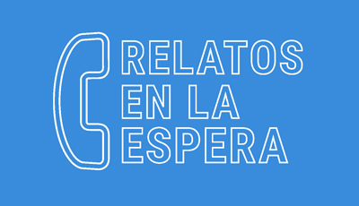

- [0. Interactivos17-Relatos en la Espera](#interactivos17-relatos-en-la-espera)
- [1. Idea](#1-idea)
- [2. Implementación](#2-implementación) 
- [3. Desarrollo de los relatos](#3-desarrollo-de-los-relatos) 
- [4. Tecnología](#4-tecnología)
- [5. Diseño de Interfaz de Usuario en producto digital](#5-diseño-de-interfaz-de-usuario-en-producto-digital)
- [6. Diseño de producto · artefacto](#6-diseño-de-producto-·-artefacto)
- [7. UX y testeo con usuarios](#7-ux-y-testeo-con-usuarios)
- [Promotores y colaboradores](#promotores-y-colaboradores)
- [Instrucciones](#instrucciones)
- [Diario del proceso](#diario-del-proceso)

# Interactivos17 - Relatos en la Espera  
Antes de empezar a movernos con el transporte público vivimos en la ‘espera’, en un tiempo muerto e insignificante. ¿Qué objeto, suceso o acontecimiento nos puede despertar del letargo de esa espera?

- [Video presentación del proyecto](https://www.youtube.com/watch?v=_y7_L4MCVnM&feature=youtu.be)

## 1. Idea
Hoy en día los usuarios del transporte público suelen recibir información del tiempo de espera. Un tiempo que hasta ahora está ocupado, principalmente, por el teléfono móvil y la publicidad de las paradas. El proyecto aprovecha ese tiempo de una forma alternativa, involucra al viajero en una experiencia extraña pero enriquecedora que sirve para contextualizar la ciudad que le envuelve. La audición de un relato que dura el tiempo de espera previsto se convierte en el detonante para viajar con la imaginación sin moverse de la parada.

## 2. Implementación

### 2.1. Estado del Arte 
Se ha hecho un rastreo de otros proyectos que se han desarrollado en torno al transporte público. Proyectos que unas veces se han centrado en la lectura de un libro, en los anuncios que suelen estar en estas paradas o en lo que ocurre durante el viaje. Para localizar la propuesta de "Relatos en la Espera" en este entorno de referencias, se ha llevado a cabo un "Mapa de usuario" que permite reconocer todas las referencias estudiadas bajo dos parámetros: nivel de relación con el factor tiempo de espera y nivel de importancia de la oralidad. Ambos factores han sido elegidos por su fuerte vinculación con el transporte; el primero por su funcionalidad, el segundo por la capacidad de despertar la imaginación y por favorecer el alejamiento del teléfono móvil o de la publicidad de una ciudadanía volcada exclusivamente en lo visual.  

+ 01 Axe, pantalla interactiva (https://www.youtube.com/watch?v=UIHwHqaY3SY)
+ 02 Expendedora de libros (http://www.lamasbella.es/bellamatic/) 
+ 03 Máquina expendedora de micro-relatos (http://lapiedradesisifo.com/2015/11/14/la-maquina-expendedora-de-relatos-cortos)
+ 04 Cuentos por teléfono (http://maguared.gov.co/project/cuentos-por-telefono-libro-de-gianni-rodari-para-ninos/)
+ 05 Cocacola, pantalla interactiva (https://www.youtube.com/watch?v=ctdYwo55pPA)
+ 06 Apotek, pantalla interactiva. (https://www.youtube.com/watch?v=tdQgsmYKxLM)
+ 07 Best Bus Ever (https://www.youtube.com/watch?v=zpdcUakdQVA)
+ 08 Billetes impresos en libros (https://www.youtube.com/watch?v=1PAkrApvkac) 
+ 09 Kulturbus (https://www.youtube.com/watch?v=W20u8qJWv2M)
+ 10 Viraphone (http://danielperlin.net/#viraphone-with-vito-acconci)
+ 11 Portadas de libros comprometidas (https://www.youtube.com/watch?v=2LyVVbhvStk)
+ 12 Photoshop en la pantalla (https://www.youtube.com/watch?v=jpRmQo1_4Es) 

### 2.2. Caso a estudiar 
De los modos de transporte donde se lleva a cabo la espera, autobús, tren o metro, realizamos una investigación previa para determinar entre cuál de las opciones haríamos la prueba de escuchar los relatos y que además fuera viable en el periodo de tiempo disponible de Interactivos17 MediaLab.

Para ello, relizamos una primera investigación de posibles estudios y estadísticas que determinaran la tipología de usuarios que frecuentan esos sistemas de transporte y el porcentaje de usuarios por hora y estación. Por ejemplo, en el caso del medio de transporte "metro" obtuvimos más información al respecto, como qué cantidad de pasajeros por estación y hora está condicionada por el entorno en el que se encuentra cada estación o como existen flujos de entrada de pasajeros en "períodos punta" en determinadas horas, o cuales representan un mayor uso en caso de usuario de que se mueven por razón de empleo-población, incluso qué estaciones de metro presentan concentraciones en la distribución de pasajeros de una manera más uniforme a lo largo del día, etc.

Finalmente, despues valorar distintas variables optamos por escoger el autobús, por tener menos elementos de distracción durante un estado de espera. Actualmente en Madrid, lugar donde se lleva a cabo el prototipo, todas las paradas de metro disponen de pantallas que indican el tiempo de espera, así como en muchas ocasiones televisiones o anuncios que juegan con la presencia del viajero en la parada. Mientras que en el autobús, la presencia de pantallas que indican el tiempo de espera es más escaso y los anuncios en las marquesinas suelen ser más genéricos. Por tanto, consideramos que podía ser más fácil el introducirnos en ese "tiempo de espera" que tiene un ciudadano mientras espera el autobús.

A continuación, de todas las líneas de autobuses que existen en Madrid, se decide por viabilidad en la experimentación y pruebas, escoger una única línea, para nuestro caso la 6. Esta línea no es de suministro, es decir no sirve para llevar a los usuarios a centros productivos de la ciudad, sino que es una línea de barrio que alimenta al barrio de Orcasitas y que puntualmente pasa por la ciudad. Por lo que los usuarios mayoritarios serían personas que viven en Madrid y frecuentan de manera recurrente dicha línea.

Además, de todas las paradas que tiene la línea 6, se escogió la que está en la plaza Tirso de Molina, y cuyas paradas de autobús recogen a más usuarios que no solo vienen de la línea 6.  Por tanto, se trata de una parada que está en una plaza muy transitada y con mucha diversidad de historia y gente, por lo que la hace ser más rica en experimentaciones para las personas que pasan por allí. Está ubicada en el centro de Madrid y cerca de Medialab Prado (lugar donde trabajamos de forma colaborativa y abierta). Otro aspecto relevante de dicha plaza es que al tener numeros árboles cercanos a la parada que dan sombra, eso favorece "el tiempo de espera" de los usuarios. Además favorece para implementación del prototipo pues evita los posibles reflejos en la pantalla y por tanto, que se obtenga una experiencia optima.

Una vez localizado nuetro foco de acción, pasamos a realizar una investigación contextualizada en el lugar. Para conocer los hábitos de los usuarios de dicha parada se ha llevado a cabo una recogida de datos tanto de forma cuantitativa, basadas en la observación e incluso interacción conversacional con la gente que estaba en dicho lugar, como de forma cualitativa. De la primera investigación cualitativa nos permitió observar las relaciones existentes, las actitudes de la gente, las tendencias o prácticas que se dan en el entorno de Tirso de Molina y de ahí sacar insight o conceptos claves para elaborar algunas de los relatos, ya que para este proyecto era verdaderamente relevante que el oyente del relato contextualizara y experimentara con su propio entorno.

La segunda investigación nos ha permitido conocer la tipología de usuarios de dicha parada y por tanto nuestro arquitipo ideal, además cuales son sus hábitos, que hacen en la parada, etc. Respecto a la recogida de datos de forma cuantitativa los datos que recogimos fueron: 
Hora de llegada/salida, hombre/mujer/otro, solo/acompañado, edad (joven/mediano/mayor), actividad (móvil/libro/bolso/conversación), si está sentado o no lo está.

Así mismo se ha llevado a cabo un cuestionario a pie de parada de autobús, obteniendo cómo resultado que el usuario mayoritario de dicha parada era mujer, principalmente sola y de edad avanzada.

.jpg)

A parte de esta recogida de datos hemos llevado a cabo una encuesta a través de las redes sociales para saber la reacción ante un posible dispositivo que cuente un relato durante las esperas. En esta ocasión la distribución de edad es mucho más repartida y las actividades que se realizan en general son más variadas. 

.jpg) 

Como resultado obtenemos que en dichas paradas hay un usuario principalmente mujer de mediana o avanzada edad que no usa teléfono móvil. Así mismo detectamos mediante los cuestionarios el escaso interés que tenían los usuarios de que suceda una actividad en las paradas, sin embargo en contraposición mostraban gran interés ante que la actividad sea un relato escuchado que permita saber más sobre la ciudad inmediata en torno a ella.

## 3. Desarrollo de los relatos 
A través de redes de contacto se ha localizado a escritores a los que se les ha dado una serie de recomendaciones a seguir: la claridad en la redacción del relato, la simplicidad y sobretodo el objetivo de que las historias sirvan para ampliar la lectura de la ciudad inmediata. Los relatos sirven para construir y para saber más de la ciudad que envuelve a la parada. Se adjunta el mail de invitación que se envió a los autores. En él se especifican la importancia del tiempo del relato, imágenes de lo que se ve desde la parada y una lista de detonantes generales que tienen el objetivo de ayudar a inventar los relatos.

Así mismo, gracias a la colaboración de actores, los textos han sido interpretados para que el contenido tuviera más incidencia en el oyente y realismo.

 

Estas son las historias elegidas junto a los relatos producidos. 
Título / Autor / Intérprete / Duración:

+ 1 Se busca poeta / Paloma Diez Temprano /	Manuel Cruz López 
+ 2 Besos en la parada /	Paloma Diez Temprano /	Manuel Cruz López 
+ 3 Chofer /	Marta Felipe Soria /	Manuel Cruz López 
+ 4 Tarde de Domingo /	Paloma Diez Temprano /	Gonzalo Pendolema 
+ 5 Un, dos, tres, cuatro vamos a divertirnos un rato /	Fran Carrillo /	Raquel Sánchez .mp3)
+ 6 La muerte y la doncella /	Bernardo Gómez /	Mónica Montoro 
+ 7 El flautista /	Julia Livaditi /	Mónica Montoro 
+ 8 Chocolate con churros /	Marta Felipe Soria /	Marta Felipe Soria 
+ 9 El tapicero /	Marta Felipe Soria /	Manuel Cruz López (hombre), Elena Peña Parrilla (mujer), Marta Felipe Soria (tapicero)
+ 10 Ocupación para desocupados /	Ángel Muñoz Jiménez,	Manuel Cruz López 
+ 11 Como no bailar salsa /	Katerina Psegiannaki /	Monica Montoro 
+ 12 En un minuto /	Bernardo Gómez 
+ 13 Bolsa para la compra /	Isabel Martín Ruiz / Isabel Martín Ruiz, Damiana Ruiz 
+ 14 Dos minutos /	MaxCooper /	Monica Montoro 
+ 15 Un fantasma en Zingarella /	Osvaldo Michelón / Osvaldo Michelón

## 4. Tecnología 
Se han barajado distintas tecnologías para llevar a cabo el dispositivo. Desde una App hasta un teléfono analógico que pudiera servir para escuchar los relatos. Dada la vinculación de la espera con el lugar donde se desarrolla, la tecnología del prototipo tendría que dar salida a este requisito. Por lo tanto la solución de una App no ha sido factible por la deslocalización del lugar y por el necesario consumo de datos que supondría trabajar con ella. A priori el uso de la tecnología "nearby" parecía la más óptima: una vibración del móvil personal cuando el viajero se acerca a la parada sería una buena solución para llevarlo a cabo, salgo que para el desarrollo del prototipo es excesivamente complejo.

Por facilidad de ejecución se decide desarrollar una tecnología mixta. Un dispositivo que con apariencia de teléfono permitiera narrar las historias y junto a él una pantalla con la que interaccionar para especificar el tiempo de espera que el usuario estima que va tardar el transporte.

El producto final ha necesitado de: 
+ Tableta android de 18 pulgadas, en donde se ha desarrollado un interfaz. 
+ Sensor de distancia. [Sensor de ultrasonido](http://www.micropik.com/PDF/HCSR04.pdf)
+ Arduino Uno
+ Batería
+ Micro switch swap
+ Cable OTG

### 4.1. Lets code
### 4.1.1. [Android App](https://github.com/fagtrivino/relatosEnLaEspera) 
### 4.2.2. [Arduino y Sensores](https://github.com/fagtrivino/interactivos17-relatosenlaespera/blob/master/4-Tecnologia/sensor2.ino)

## 5. Diseño de Interfaz de Usuario en producto digital
Dado el diseño del prototipo, la experiencia de usuario en la interación con el producto digital, se ha basado en dos puntos importantes: en el diseño de un interface en la pantalla del dispositivo y en la primera experiencia auditiva que recibe el usuario.

Partiendo de que los posibles usuarios más frecuentes que pudieran interactuar con nuestro "artefacto de relatos", eran personas mayores, debíamos hacer un diseño centrados en los mismos. Por lo que debíamos crear una interfaz intuitivamente obvia. Además, esto definió que para elaborar este prototipo usaramos una tableta y no un móvil (por tener una pantalla más grande).
"Un sistema técnico es, en el contexto de una determinada tarea, intuitivamente utilizable mientras que el usuario en concreto es capaz de interactuar eficazmente, no conscientemente sino usando conocimiento previo." 
Así, pues debíamos hacer una navegación entre pantallas tremendamente sencilla, acompañada de iconos y textos facilmente reconocibles y fáciles de entender y con una alta comprensión. Además, el modo que se presenta dicha interfaz, es decir incluida dentro de un artefacto similar a un teléfono "clásico" que exitía en todas las casas, acercaba más al usuario a saber como usarlo ya que tiene unas propiedades culturales ya aprendidas, ya que en todas las casas existía un "telefono fijo" y por tanto la forma de cogerlo ya es un gesto aprendido.

Referente a la línea gráfica que decidimos seguir, concluimos que fuera similar a la propia EMT (Empresa de Transporte de Madrid) cogiendo así su color corporativo ya que esto permitiría que a la hora de que el usuario contactara con el artefacto lo relacionara con la EMT y no sintiera un rechazo de manera inicial, al no saber exactamente de que se trataba, así que la simplicidad y el color corporativo nos permitiría cierta confianza y credibilidad. La primera pantalla se considera importante, ya que es la que invita al usuario a usar el dispositivo, de ahí que usaramos un pictograma con cierto parecido a una persona mayor, pero en definitiva tenía que dar una sensación amigable y que produjera cierta simpatía.

Respecto a los elementos de la interfaz, debíamos enfocarlos al uso que harían las personas mayores. Por tanto, la visión y la audición eran factores primordiales, las tipografías debían ser más grandes, que tuviera un alto contraste entre elementos, que los botones fueran más grande de lo habitual, etc. Por otro lado la primera experiencia auditiva se vuelve muy importante para empatizar con el usuario. Por ello se incorporo una frase (locución inicial) "Hola soy Leo, estoy aquí para hacer tu espera más amena, lo único que necesito de ti es que me selecciones cuánto tiempo vas a esperar" donde alguien (persona) llamado Leo explica lo que va a ocurrir a continuación. Para la elección del personaje que habla al otro lado de la línea, se escogió el nombre de Leo por la propia ambigüedad de género que transmite, así como una frase natural (natural language ui) que intente alejarse de las respuestas automatizadas de los servicios telefónicos habituales. Aun así, este último factor surgió despues de un primer testeo del diseño, donde salió a relucir la duda... si cuando cogías el teléfono hablabas con una persona o con una máquina, finalmente obtamos por usar una persona y ajustamos todos los textos (copys), ya que el los diseños anteriores de la interfaz mezclábamos textos donde en ocasiones hablaba la máquina-dispositivo y otros una persona.

A continuación mostramos la interfaz final:

## 6. Diseño de producto · artefacto 
El diseño del dispositivo se basa en la integración de una tablet de 18", un sensor de distancia, un arduino, una batería y el cuelgue del mango del teléfono. Un solo elemento que actúa como cabina telefónica, colgado a través de unas cinchas a la altura de una persona sentada. Dado que el dispositivo estará en la parada y que en ocasiones el sol puede llegar generar un brillo que dificulte la lectura en la pantalla, el diseño incluye una pequeña visera que se integra en el diseño final.

El material usado para el dispositivo principal es madera DM cortada a laser, de 5 mm de espesor. El diseño del mango telefónico es de madera pero de 3mm de espesor. La madera tanto del manguito como del dispositivo se resuelve con ensambles en L.

El modelo desarrollado no es impermeable, pero sería necesario su planteamiento en el caso de que se llevara a cabo en otra escala.

Para el modelado se ha utilizado el sowftware Solidwords, y para el corte láser DraftSight-3DS. Se adjuntan en la carpeta correspondiente.

## 7. UX y testeo con usuarios
Durante el proceso de desarrollo del prototipo, se salió a la calle en varias ocasiones midiendo distintas variables de nuestro proyecto

Antes de cerrar el protopipo definitivo se realizón un "test de usuario", en el que los usuarios experimentan con nuestro producto y/o servicio, y mediante la observación de los mismos sacamos conclusiones, errores y mejoras que debe sufrir el proyecto. Para este caso se les pedía a los usuarios que esperaban el autobús, que interactuasen con nuestro Mínimo Producto Viable de "Relatos en la Espera" y escucharan un relato. La mayoría conseguían terminar la tarea de principio a fin, sin embargo (a destacar) si pudimos observar que cuando los relatos eran muy largos los usuarios dejaban de prestarle atención o se cansaban del proceso... por tanto, en este punto se tendría que volver a iterar, cuestionándose y testeando nuevamente esa relación entre tiempo de espera y tamaño del relato.

# Promotores y colaboradores: 
### Equipo: 
+ Katerina Psegiannaki (www.kuneoffice.com/)
+ Francisco García Triviño (http://www.kuneoffice.com/)
+ José Manuel López Ujaque (http://www.kuneoffice.com/)
### Colaboradores
+ Sandra Vivar Maestre (www.sandramind.design)
+ Katalina Soto Rivera (https://www.behance.net/katakatasoto)
+ Mario Alejandro Alzate López (www.marioalzatelopez.com)
+ Inmanulada Marruecos Payán (www.behance.net/inmarru)
+ Marta Felipe Soria 
### Autores e Interpretadores de los textos
+ Manuel de la Cruz (interprete)
+ Gonzalo Pendolema (interprete)
+ Raquel Sánchez (interprete)
+ Monica Montoro (interprete)
+ Marta Felipe Soria (autora e interprete)
+ Elena Peña Parrilla (interprete)
+ Ángel Muñoz Jimenez (autor)
+ Bernardo Gómez (autor e interprete)
+ Esther Iorfida (autor)
+ Fran Carrillo (autor)
+ Julia Livaditi (autor)
+ Osvaldo Michelón (autor e interprete)
+ Paloma Díez (autor)
+ Isa martin ruiz (autora e interprete)

# Instrucciones
### Instrucciones de Expo
+ Video del proyecto, en la carpeta RELATO ( en el escritorio ). Arranca automatico en ubuntu con el video en fullscreen. 
+ Una Cabina telefónica con un telefono interactivo. 

### Instrucciones de montaje y desmontaje
+ Qué material se necesita
1. Cabina de telefono interactiva.
2. Cascos de audio para el vídeo.

+ Cómo se ensambla todo
Tenemos un powerBank que alimenta el altavoz bluetooh.

+ En qué puntos hay que tener cuidado
1. Cable OTG se deconecta facilmente. 
2. La tapa frontal hay que abrirla como si fuera una bisagra a su parte izquierda. 
3. Todos los elementos dejarlos conectados a sus cargadores ( powerback, tablet ) manualmente. 

### Instrucciones de funcionamiento
+ ¿Cómo se enciende? ¿Cómo se apaga?
Resumen de como debería funcionar el artefacto de las historias:
1. Colocarse frente el telefono. Hay un sensor que detecta la presencia si estas no más de 3 metros del dispositivo (frente al artefacto). 
2. Suena llamada y se contestas al telefono, 
3. Eliges tiempo de espera, escuchas el relato, y cuelgas.

Para que el aparato se mantenga encendido el Tablet tiene que estar cargado. Para cargar el Tablet hay que desenchufar el Arduino que está conectado en el puerto micro USB inferior y conectarlo a un cargador Android. 
Para que el altavoz que está dentro del teléfono se mantenga encendido tiene que estar conectado a la batería portable que está dentro de la caja.

Para que la batería que está dentro de la caja se mantenga encendida tiene que estar conectada con un cargador Android a la luz. 
Para apagar y encender el tablet es necesario descolgar el teléfono y acceder al botón de encendido y apagado, a través del agujero superior de dónde cuelga el teléfono. Ahí hay un botón largo que es el volumen y otro botón más pequeño que es el encender-apagar. 
Para apagar y encender la batería portable es necesario descolgar el teléfono y acceder al botón de encendido y apagado, a través del agujero superior de dónde cuelga el teléfono. Previo a esto para poder acceder más fácilmente al botón retirar el USB conectado a la misma batería. Se enciende una luz azul.

Para apagar y encender el altavoz es necesario abrir la puerta superior del teléfono y pulsar el botón posterior. Se puede comprobar que el altavoz está encendido porque puede verse una luz roja (encendido y cargando) o azul (encendido y no cargando).

+ ¿Qué hace exactamente? ¿Cómo interactuar con el dispositivo? (pensar que la gente que lo ve no ha estado en el taller). 
Para poder interactuar con el aparato hay que cumplir con las siguientes condiciones con el orden indicado. 
Requisitos:
1. La Tablet encendida y el altavoz encendido
2. El teléfono tiene que estar colgado para que el switch esté cerrado. 
3. La App “relatos en la espera” tiene que estar activa.
4. Conectar el Arduino en la Tablet. En el mensaje: “Allow the app Relatos en la Espera to acces the USB device” cliquear “Use by default for this USB device” y a continuación decir OK.

Una vez todas las condiciones previas cumplan puede empezar la interacción con el usuario (ciudadano o espectador):
• La primera pantalla de la app dice: “tenemos una historia que contarte” e invita el usuario a acercarse. 

• Al acercarse el usuario a los 60 cm o más cerca el sensor ultrasonido hace que se active la siguiente pantalla que dice: “Hola, te estoy llamando” e invita el usuario descolgar el teléfono que en este momento está sonando.

• Al descolgar el usuario el teléfono que está sonando aparece directamente otra pantalla que pregunta: “¿Cuánto tiempo crees que vas a esperar?” y da la posibilidad al usuario a escoger un botón desde 1 minuto hasta más de 10 minutos. También se puede contestar “No lo sé”. Por el telefonillo se oye “Hola soy Leo, estoy aquí para hacer tu espera más amena, lo único que necesito de ti es que selecciones cuanto tiempo vas a esperar”.

• Al elegir un botón el usuario se pasa a una nueva pantalla que dice “escúchame”. Por el telefonillo se oye un relato que dura aproximadamente el tiempo de la espera que ha seleccionado el usuario. Esta pantalla sigue así durante todo el tiempo que se oye el relato. 

• Una vez acabado el relato aparece una pantalla que dice “FIN” e indica los créditos del relato “Titulo, Autor, Locutor”. Después de un corto tiempo sale automáticamente otra pantalla que dice “Hasta Luego” y pide al usuario volver a colgar el teléfono para que otro usuario pueda seguir interactuando con el aparato. 

### Instrucciones de mantenimiento
+ ¿Tiene batería? ¿Cómo cargarla? ¿Cada cuánto?
1. Para que el aparato se mantenga encendido la tableta tiene que estar cargada. Para cargar dicho dispositivo hay que desenchufar el Arduino que está conectado en el puerto micro USB inferior y conectarlo a un cargador Android. 
2. Para que el altavoz que está dentro del teléfono se mantenga encendido tiene que estar conectado a la batería portable que está dentro de la caja (abrir interior del artefacto).
3. Para que la batería que está dentro de la caja se mantenga encendida tiene que estar conectada con un cargador Android desde un micro USB a un enchufe.

• El power-bank está conectado al altavoz. 
• 10000 (mAh) power bank / 250 (mAh) altavoz = 40 cargas
• 40 cargas x 45 minutos la carga = 1800 minutos (30 horas)
Se recomienda hacer el período de carga tanto de la batería portable como de la tableta cuando no esté en uso y al final de cada día. Aun así, la batería portable puede estar conectada también durante el uso del aparato. 

+ ¿Utiliza materiales desechables? ¿tintas? ¿papel?
Para la exposición se ha considerado pegar cinta adhesiva azul (emule a una parada de autobús):
• suelo: delimita el espacio donde ocurrirá la experiencia simulando una marquesina que ocupa 1m2. En caso de que se moviese la exposición sería necesario volver a pegar la cinta en el suelo tal y como se ha descrito. Además se
• expositor: con la cinta adhesiva se colocarán dos franjas, una colocada al final de la parte vertical del expositor y otra colocada al final de la parte inclinada del mismo expositor. En la exposición se ha creado un panel simulado del recorrido de una línea de autobús. El formato de este documento es 18x41,1cm. En caso de que se dañase el panel debería volver a imprirse y pegarse sobre un panel de cartón pluma que tendrá las mismas medidas. Se colocará en el lugar que ese indica en el gráfico.
+ Si deja de funcionar cuál sería la lista de errores más corrientes: de los más comunes a los más raros. ¿Cómo arreglar cada uno?
• suelo: delimita el espacio donde ocurrirá la experiencia simulando una marquesina que ocupa 1m2. En caso de que se moviese la exposición sería necesario volver a pegar la cinta en el suelo tal y como se ha descrito. Además se 
• expositor: con la cinta adhesiva se colocarán dos franjas, una colocada al final de la parte vertical del expositor y otra colocada al final de la parte inclinada del mismo expositor.
• Para la exposición se ha creado un panel simulado del recorrido de una línea de autobús. El formato de este documento es 18x41,1cm. En caso de que se dañase el panel debería volver a imprirse y pegarse sobre un panel de cartón pluma que tendrá las mismas medidas. Se colocará en el lugar que ese indica en el gráfico.

# Diario del proceso
### Semana 1
En esta semana se hizo una presentación de la idea, los colaboradores expusieron sus perfiles y se comenzó con una definición del estado del arte que nos supuso una búsqueda de referencias para definirnos y diferenciarnos.
Durante la primera semana, el cuestionamiento y la viabilidad del prototipo ha tomado el máximo protagonismo. Se analizó la viabilidad técnica y se cuestió el formato del prototipo: si era vía móvil/tablet, si era una app o si lo adaptábamos a un antiguo walkman con auriculares. Las mentorías han cuestionado las distintas áreas que forman el proyecto y nos han invitado a concentrarnos en las historias para que el dispositivo sea lo más sencillo posible. 

### Semana 2
El desarrollo de las historias ha sido lo más importante así como la búsqueda de escritores y actores que locuten e interpreten los textos. Se ha creado un texto, enviado a los autores, con pautas sobre cómo hemos definido que deben ser los relatos. Algunas de estas pautas por ejemplo son: que el relato se localice en la plaza de de Tirso de Molina y en concreto en la parada del autobús; que el tiempo de la historia sea el presente y sin saltos al pasado; o que tengan un lenguaje sencillo y directo puesto que van a ser relatos escuchados. Se ha realizado también la grabación de los audios con actores y locutores y hemos decidido mantener los diversos acentos de nuestros intérpretes porque hemos querido representar el abanico de nacionalidades de una ciudad como Madrid y en concreto de los usuarios de dicha plaza. 
Asimismo esta semana hemos desarrollado el dispotivo básico así como la interfaz y los colores que la caracterizan (colores que hemos decidido que sean similares a los de la EMT para vincular nuestro prototipo con los tiempos de la espera de los autobuses); sin embargo a pesar de la sencillez, hemos necesitado mucho más tiempo del esperado. Han empezado a surgir errores tecnológicos fundamentalmente debidos a la interactuación entre el arduino y la tablet.

### Semana 3
La última semana ha sido en la que más situaciones de tensión han surgido porque hemos detectado también errores de diseño.  Se ha salido a la parada del bus para hacer el testeo del producto y hemos constatado errores de funcionamiento. Hasta el último día no funcionó, y los ensayos se realizaron sin el dispositivo a pleno rendimiento.
También en esta semana se ha compilado toda la información recogida, se ha llevado a cabo toda la producción de la narrativa y se ha hecho el planteamiento de la exposición. Se ha creado un panel informativo con unas aparentes paradas del autobús que refleja el recorrido del proyecto (origen Medialab, destino Relatos en la espera) y cuyas paradas son los títulos de todos los relatos.
Los últimos días son de cierre y perfeccionamiento de los errores detectados. Y de preparativos de la exposición.

